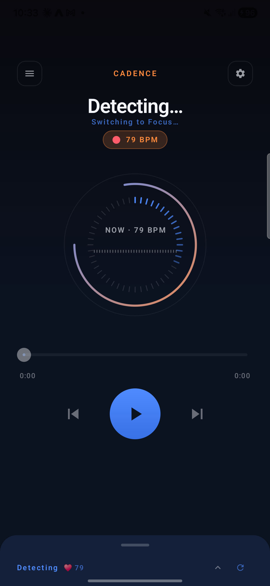
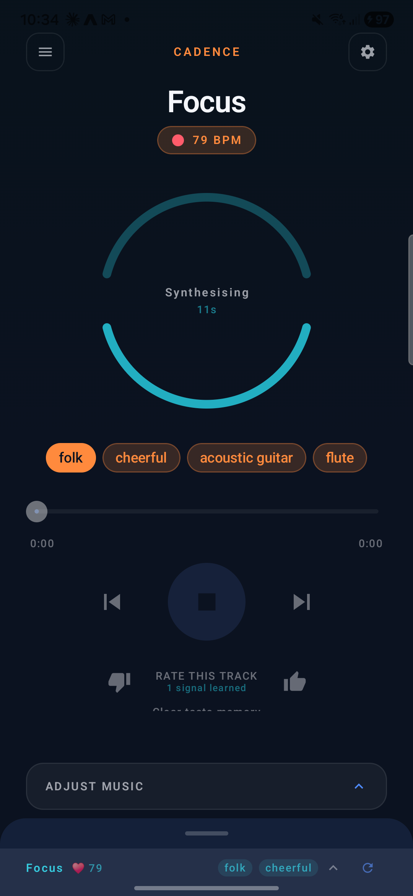
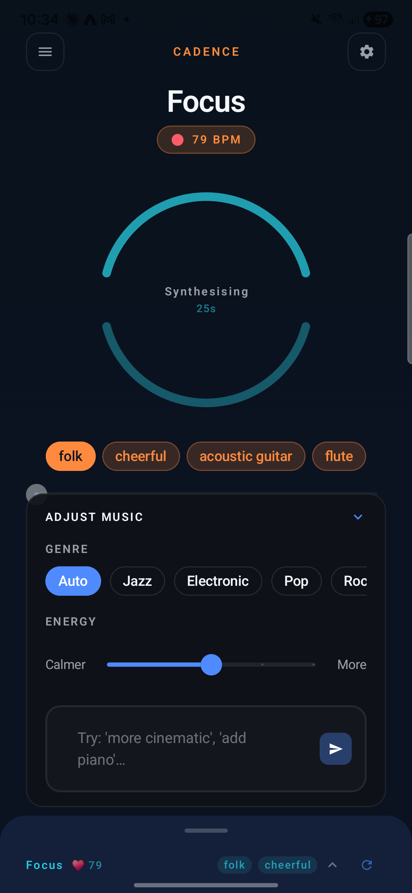
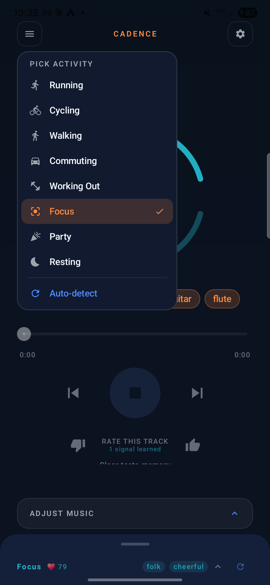
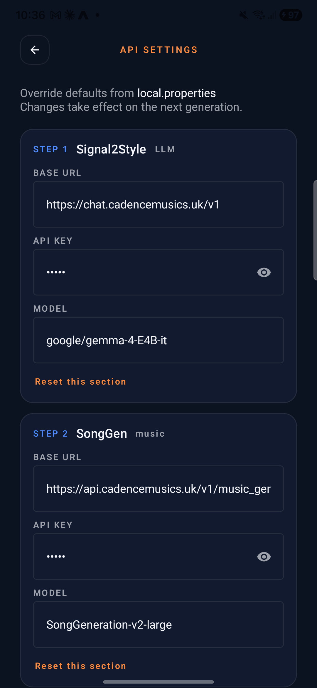

<div align="center">


# Cadence AI Music

### Biometric-Adaptive Music for Real-Time Mood Regulation

[](https://developer.android.com)
[](https://kotlinlang.org)
[](https://play.google.com)

**Cadence** continuously reads your physiological state and generates personalised instrumental music in real time — grounded in the *iso-principle*: matching music to your current state before gradually steering it toward a desired emotional target.

</div>

---

## Screenshots

<table>
  <tr>
    <td align="center"><br/><sub><b>Player</b><br/>Live scene & heart rate</sub></td>
    <td align="center"><br/><sub><b>Synthesising</b><br/>Generation in progress</sub></td>
    <td align="center"><br/><sub><b>Adjust Music</b><br/>Genre, energy, free-text prompt</sub></td>
    <td align="center"><br/><sub><b>Activity Picker</b><br/>Manual context override</sub></td>
    <td align="center"><br/><sub><b>API Settings</b><br/>Swap in any compatible backend</sub></td>
  </tr>
</table>

---

## Scientific Background

Music is among the most effective strategies for everyday emotion regulation. The **iso-principle** — matching music to a listener's psychophysiological state before shifting it toward a target — has controlled experimental support, producing significantly higher positive affect than passive listening. Neurobiologically, music modulates cortisol, autonomic arousal, and reward circuitry.

These effects depend critically on *fit* between musical properties and real-time listener state. No existing consumer system achieves this automatically. Cadence is a functional prototype addressing this gap.

---

## Two-Step AI Pipeline

```
┌─────────────────────────────────────────────────────────────┐
│                      SENSOR LAYER                           │
│  Heart Rate · HRV · SpO2 · Sleep · Steps · GPS · Weather    │
└────────────────────────┬────────────────────────────────────┘
                         │
                         ▼
┌─────────────────────────────────────────────────────────────┐
│               STEP 1 — Context Translation                  │
│  LLM — any OpenAI-compatible chat endpoint                  │
│  Biometric context → Mental state estimation                │
│  (arousal · valence · stress · energy · focus)              │
│  → Song parameters (genre tags · BPM · mood · intensity)    │
└────────────────────────┬────────────────────────────────────┘
                         │
                         ▼
┌─────────────────────────────────────────────────────────────┐
│               STEP 2 — Music Generation                     │
│  Text-to-music model (MiniMax, SongGeneration, etc.)        │
│  Song parameters → Instrumental MP3                         │
└────────────────────────┬────────────────────────────────────┘
                         │
                         ▼
┌─────────────────────────────────────────────────────────────┐
│              PRE-BUFFERED PLAYBACK                          │
│  2-item buffer · seamless transitions                       │
│  Reprimed on scene change or HR drift ±15 bpm               │
└─────────────────────────────────────────────────────────────┘
```

All biometric data is **processed on-device**. Only anonymised contextual summaries are transmitted for music generation.

---

## Scene Detection

Cadence classifies your activity context from sensor fusion and uses it to shape generation:

| Scene | Trigger | Musical intent |
|---|---|---|
| Running | Speed > 8 km/h or HR > 135 bpm | High-energy, tempo-matched |
| Walking | Speed 3–8 km/h | Mid-tempo, steady |
| Commuting | Speed > 25 km/h | Alert, low-distraction |
| Working Out | Manual | Energetic, motivational |
| Focus | Manual | Minimal, concentration-supporting |
| Resting | Low movement / default | Slow, restorative, ambient |
| Party | Manual | Upbeat, social |

---

## Research Transparency

The app exposes its full reasoning chain in real time so users understand *why* a piece of music was generated:

- **Biometric input** — raw sensor readings with weather and location context
- **Mental state estimation** — scored dimensions: arousal, valence, stress, energy, focus, mood
- **Music recommendation** — selected style, genre tags, and lyric scaffold
- **Override & feedback** — users may adjust any parameter or rate tracks; a taste profile adapts over time

This design supports informed consent and user agency — principles central to responsible AI deployment in health contexts.

---

## Requirements

- Android 10+ (API 30)
- [Health Connect](https://play.google.com/store/apps/details?id=com.google.android.apps.healthdata) — heart rate, HRV, sleep, SpO2
- Location permission — GPS speed and weather
- A compatible wearable: Fitbit, Samsung Galaxy Watch, Pixel Watch, or any Health Connect–compatible device

---

## Setup

Cadence's two pipeline stages each call an HTTP endpoint, and both are configurable in-app via **API Settings**. You can mix and match:

- **Step 1 — LLM** (biometrics → song style): any OpenAI-compatible chat endpoint — [OpenRouter](https://openrouter.ai/), a local Ollama / vLLM server, or the bundled `cadence-api` LLM endpoint.
- **Step 2 — Music generation**: a text-to-music endpoint such as [MiniMax Music](https://www.minimax.io/), a self-hosted [SongGeneration](https://github.com/tencent-ailab/SongGeneration) server, or the bundled `cadence-api` music endpoint.

### Self-hosted reference server (optional)

[**wtgme/cadence-api**](https://github.com/wtgme/cadence-api) packages both pipeline stages into a single FastAPI service: an OpenAI-compatible chat endpoint backed by your model of choice, plus a SongGeneration wrapper. Useful if you want full local control or a private GPU deployment. **It is not required** — any compatible third-party APIs work.

Set defaults at build time via `local.properties` (override in-app from the settings screen):

```
signal2style.base.url=https://openrouter.ai/api/v1     # or your cadence-api host
signal2style.api.key=<your-key>
signal2style.model=google/gemma-3-4b-it:free

songgen.base.url=https://api.minimax.io/v1/music_generation   # or your cadence-api host
songgen.api.key=<your-key>
songgen.model=music-2.6
```

### Build

```bash
./gradlew assembleDebug     # debug APK
./gradlew assembleRelease   # release APK (minified)
./gradlew test              # unit tests
```

---

## Architecture

Clean Architecture · MVVM · Hilt DI · Kotlin 2.0 · Jetpack Compose · Media3/ExoPlayer

```
app/
├── ui/           Compose screens (Player, Debug, Permissions) + ViewModels
├── audio/        MusicOrchestrator · AudioBufferManager · MusicPlayerService
├── data/
│   ├── api/      GenerationRepository · MusicRepository · SongParams (Moshi)
│   ├── model/    Scene · SensorState · GeneratedSong
│   └── sensor/   Health Connect · GPS · Weather · Sleep integrations
├── domain/       SceneDetector · SceneStateMachine · PromptBuilder · ReadinessCalculator
└── di/           Hilt modules
```

---

<div align="center">

*Cadence is under review for release on the Google Play Store.*

</div>
