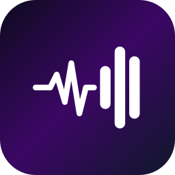
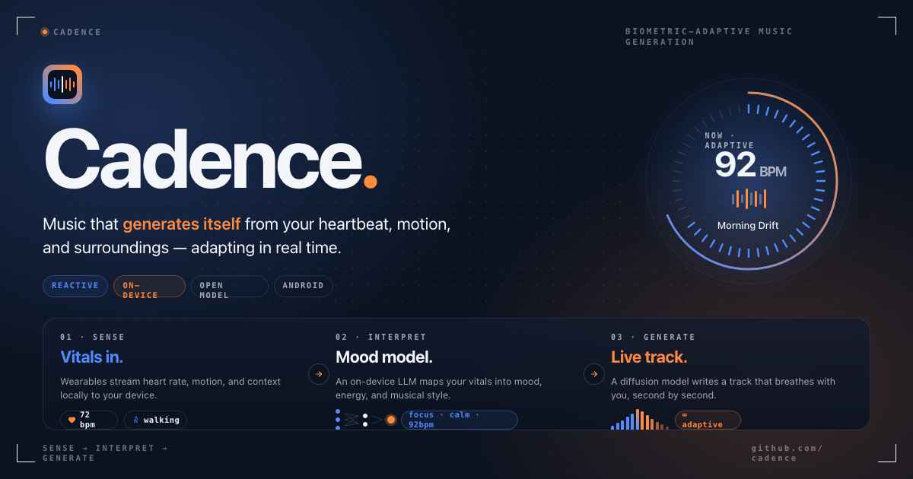

<div align="center">



# Cadence AI 音乐

### 基于生物特征自适应的实时情绪调节音乐

[English](README.md) · **简体中文**

[](https://developer.android.com)
[](https://kotlinlang.org)
[](https://play.google.com/apps/internaltest/4701327609853151006)



**Cadence** 持续读取你的生理状态，并基于 *同质原理*（iso-principle）实时生成个性化的器乐音乐——先匹配你当前的状态，再逐步将其引导至期望的情绪目标。

---

### 加入封闭测试

**无需智能手表——仅需手机即可参与。**

[加入 Google 用户组（未完成此步骤其他链接将无法使用）](https://groups.google.com/g/cadence-ai-music) · [成为测试者](https://play.google.com/apps/testing/io.cadence.music) · [下载应用](https://play.google.com/store/apps/details?id=io.cadence.music)

</div>

---

## 应用截图

<table>
  <tr>
    <td align="center"><br/><sub><b>欢迎</b><br/>引导入口</sub></td>
    <td align="center"><br/><sub><b>创建账户</b><br/>注册开始使用</sub></td>
    <td align="center"><br/><sub><b>配对设备</b><br/>连接你的可穿戴设备</sub></td>
    <td align="center"><br/><sub><b>权限</b><br/>Health Connect 与位置</sub></td>
  </tr>
  <tr>
    <td align="center"><br/><sub><b>口味初始化</b><br/>个性化你的偏好档案</sub></td>
    <td align="center"><br/><sub><b>就绪</b><br/>开始生成音乐</sub></td>
    <td align="center"><br/><sub><b>调整音乐</b><br/>风格、能量、自由文本提示</sub></td>
    <td align="center"><br/><sub><b>AI 推理</b><br/>完整推理链</sub></td>
  </tr>
</table>

---

## 科学背景

音乐是日常情绪调节中最有效的策略之一。**同质原理**——先让音乐匹配听者的心理生理状态，再将其引向目标状态——已获得受控实验的支持，相较被动聆听能显著提升积极情绪。从神经生物学的角度看，音乐可调节皮质醇水平、自主神经唤起以及奖赏环路。

这些效应高度依赖音乐属性与听者实时状态之间的 *契合度*。目前没有任何消费级系统能自动实现这一点。Cadence 是一款针对此空白的功能性原型。

---

## 两步式 AI 流水线

```
┌─────────────────────────────────────────────────────────────┐
│                       传感器层                              │
│  心率 · HRV · 血氧 · 睡眠 · 步数 · GPS · 天气               │
└────────────────────────┬────────────────────────────────────┘
                         │
                         ▼
┌─────────────────────────────────────────────────────────────┐
│              第 1 步 —— 情境翻译                            │
│  LLM —— 任意兼容 OpenAI 的 chat 接口                        │
│  生物特征情境 → 心理状态估计                                │
│  （唤起度 · 效价 · 压力 · 能量 · 专注度）                   │
│  → 歌曲参数（风格标签 · BPM · 情绪 · 强度）                 │
└────────────────────────┬────────────────────────────────────┘
                         │
                         ▼
┌─────────────────────────────────────────────────────────────┐
│              第 2 步 —— 音乐生成                            │
│  文本到音乐模型（MiniMax、SongGeneration 等）               │
│  歌曲参数 → 器乐 MP3                                        │
└────────────────────────┬────────────────────────────────────┘
                         │
                         ▼
┌─────────────────────────────────────────────────────────────┐
│                 预缓冲播放                                  │
│  2 项缓冲 · 无缝切换                                        │
│  情景变化或心率漂移 ±15 bpm 时重新触发                      │
└─────────────────────────────────────────────────────────────┘
```

所有生物特征数据均在 **设备端处理**。仅匿名化的情境摘要会被传输用于音乐生成。

---

## 情景识别

Cadence 通过传感器融合对你的活动情景进行分类，并据此塑造生成结果：

| 情景 | 触发条件 | 音乐意图 |
|---|---|---|
| 跑步 | 速度 > 8 km/h 或心率 > 135 bpm | 高能量、节拍匹配 |
| 步行 | 速度 3–8 km/h | 中等节奏、平稳 |
| 通勤 | 速度 > 25 km/h | 提神、低干扰 |
| 健身 | 手动 | 充满活力、激励性 |
| 专注 | 手动 | 极简、支持专注 |
| 休息 | 低运动量 / 默认 | 缓慢、舒缓、氛围化 |
| 派对 | 手动 | 欢快、社交氛围 |

---

## 研究透明度

应用会实时展示其完整的推理链，让用户理解 *为什么* 生成了这段音乐：

- **生物特征输入** —— 原始传感器读数，附带天气和位置情境
- **心理状态估计** —— 量化维度：唤起度、效价、压力、能量、专注度、情绪
- **音乐推荐** —— 所选风格、流派标签与歌词框架
- **覆盖与反馈** —— 用户可调整任意参数或评价曲目；口味档案会随时间适配

这种设计支持知情同意与用户自主权——这是健康场景下负责任 AI 部署的核心原则。

---

## 系统要求

- Android 10+（API 30）
- [Health Connect](https://play.google.com/store/apps/details?id=com.google.android.apps.healthdata) —— 心率、HRV、睡眠、血氧
- 位置权限 —— GPS 速度与天气
- 兼容的可穿戴设备：Fitbit、三星 Galaxy Watch、Pixel Watch，或任何兼容 Health Connect 的设备

---

## 配置

Cadence 的两个流水线阶段各自调用一个 HTTP 接口，两者都可在应用内通过 **API 设置** 进行配置。你可以自由搭配：

- **第 1 步 —— LLM**（生物特征 → 歌曲风格）：任意兼容 OpenAI 的 chat 接口——[OpenRouter](https://openrouter.ai/)、本地 Ollama / vLLM 服务，或随附的 `cadence-api` LLM 接口。
- **第 2 步 —— 音乐生成**：文本到音乐接口，例如 [MiniMax Music](https://www.minimax.io/)、自托管的 [SongGeneration](https://github.com/tencent-ailab/SongGeneration) 服务，或随附的 `cadence-api` 音乐接口。

### 自托管参考服务器（可选）

[**wtgme/cadence-api**](https://github.com/wtgme/cadence-api) 将两个流水线阶段打包为单个 FastAPI 服务：一个由你选择的模型支持的 OpenAI 兼容 chat 接口，加上一个 SongGeneration 封装。若你想要完全的本地控制或私有 GPU 部署会很有用。**它并非必需**——任何兼容的第三方 API 都可使用。

通过 `local.properties` 设置构建时默认值（可在应用设置页中覆盖）：

```
signal2style.base.url=https://openrouter.ai/api/v1     # 或你的 cadence-api 主机
signal2style.api.key=<你的-key>
signal2style.model=google/gemma-3-4b-it:free

songgen.base.url=https://api.minimax.io/v1/music_generation   # 或你的 cadence-api 主机
songgen.api.key=<你的-key>
songgen.model=music-2.6
```

### 构建

```bash
./gradlew assembleDebug     # 调试版 APK
./gradlew assembleRelease   # 发布版 APK（已压缩）
./gradlew test              # 单元测试
```

---

## 架构

Clean Architecture · MVVM · Hilt DI · Kotlin 2.0 · Jetpack Compose · Media3/ExoPlayer

```
app/
├── ui/           Compose 界面（Player、Debug、Permissions）+ ViewModel
├── audio/        MusicOrchestrator · AudioBufferManager · MusicPlayerService
├── data/
│   ├── api/      GenerationRepository · MusicRepository · SongParams（Moshi）
│   ├── model/    Scene · SensorState · GeneratedSong
│   └── sensor/   Health Connect · GPS · 天气 · 睡眠集成
├── domain/       SceneDetector · SceneStateMachine · PromptBuilder · ReadinessCalculator
└── di/           Hilt 模块
```

---

<div align="center">

*Cadence 正在 Google Play 商店审核中。*

</div>
